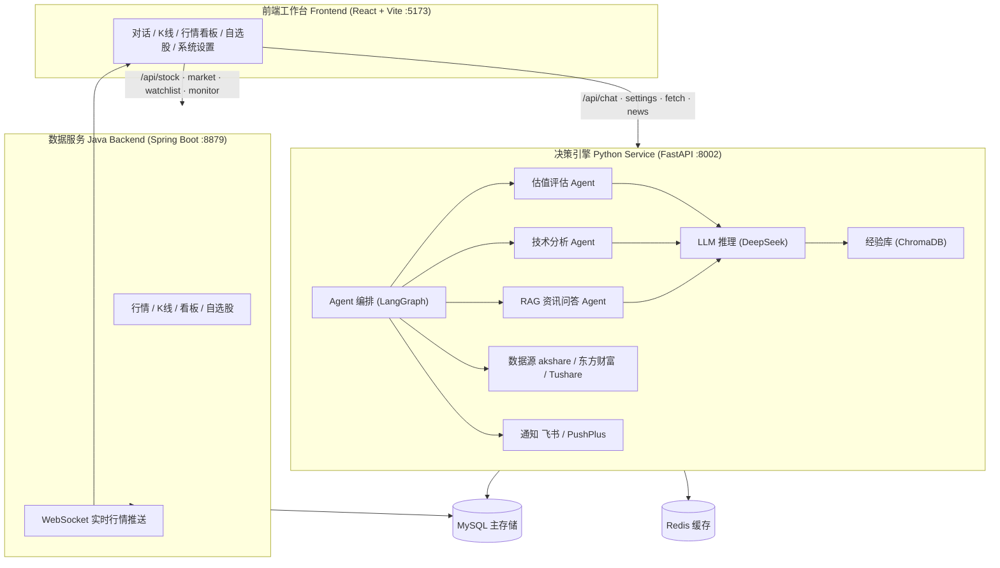

# Investment-Compass

A 股投研助手：**估值评估 + 技术分析** 两阶段决策服务。覆盖估值打分、技术面方向判断、Agentic RAG 资讯问答、自选股管理与消息通知（飞书 / PushPlus）。

> 数据范围：仅支持 A 股市场。

    

---

## 目录

- [功能特性](#功能特性)
- [架构总览](#架构总览)
- [快速开始](#快速开始)
- [使用说明](#使用说明)
- [配置参考](#配置参考)
- [数据模型](#数据模型)
- [项目结构](#项目结构)
- [开发指南](#开发指南)
- [贡献指南](#贡献指南)
- [安全说明](#安全说明)
- [License](#license)

---

## 功能特性

**两阶段决策管线**
- 估值评估（`value_assessment`）：0-100 综合评分 + 等级判定（good / fair / average / poor）
- 人工确认（HITL）：估值结果展示后征求用户决策（批准 / 拒绝 / 补充），避免机器直接下单建议
- 技术分析（`technical_analysis`）：方向判断（buy / sell / neutral）+ 置信度 + 支撑阻力位

**Agentic RAG 资讯问答**
- 检索回答带引用编号 `[1][2]`，可溯源
- 概念解释、资讯解读、买卖逻辑问答

**经验自进化**
- 基于历史决策自动沉淀**投资风格画像**（风险偏好 / 周期 / 仓位集中度等维度）
- 经验库向量检索（ChromaDB），让后续分析借鉴历史结论

**数据与集成**
- 多数据源：akshare / 东方财富 / Tushare，可配置切换
- 行情看板 / K 线 / 自选股 / 财务数据，WebSocket 实时行情推送
- 消息通知：飞书 Webhook / PushPlus

**安全**
- LLM / 飞书等凭据经 Fernet 对称加密后落盘（`config/.config.key` 本地生成，不入库）
- 密钥、日志、运行数据均被 `.gitignore` 排除，杜绝凭据入库

## 架构总览



> 图源文件见 [`docs/architecture-overview.mmd`](docs/architecture-overview.mmd)

**模块职责**

| 模块 | 技术栈 | 职责 |
|---|---|---|
| `frontend/` | React 19 · Vite · TypeScript · lightweight-charts | 工作台 UI，Vite 代理按路由分流到两个后端 |
| `python-service/` | FastAPI · LangGraph · SQLAlchemy · ChromaDB · akshare | 决策引擎：Agent 编排 / 估值 / 技术分析 / RAG / 偏好画像 / 数据同步 |
| `java-backend/` | Spring Boot 3 · Java 21 · MyBatis-Flex · WebSocket | 行情 / K 线 / 看板 / 自选股 / 实时推送 |
| `sql/` | MySQL 迁移脚本（Flyway 风格） | 库表结构与约束 |

**一次完整分析请求的调用链**

```
用户提问 → Frontend /api/chat → Python Service
  → 估值评估 Agent（LLM + 数据源）
  → 返回估值结果，HITL 征求用户确认
  → 用户批准 → 技术分析 Agent（结合估值摘要）
  → 汇总输出建议（buy / sell / neutral）
```

## 快速开始

### 环境要求

- Python 3.11+、Node 18+、JDK 21、Maven 3.9+
- MySQL 8+、Redis

### 1. 初始化数据库

```bash
# 创建数据库 investment_compass 并执行 sql/ 下迁移脚本
python scripts/init_db.py
```

### 2. 启动决策引擎（Python Service）

```bash
cd python-service
pip install -r requirements.txt
python main.py            # http://localhost:8002，健康检查 GET /health
```

### 3. 启动数据服务（Java Backend）

```bash
cd java-backend
mvn spring-boot:run       # http://localhost:8879/api
```

### 4. 启动前端工作台

```bash
cd frontend
npm install
npm run dev               # http://localhost:5173
```

### 5. 首次配置

打开工作台 → **系统设置**，填入 DeepSeek API Key（可选飞书 Webhook），保存即自动加密落盘。

## 使用说明

- **估值 + 技术分析**：输入股票代码或名称 → 估值评分 → 确认后输出技术方向建议
- **纯技术分析**：明确要求只看技术面时，跳过估值直接进入技术分析
- **资讯问答**：询问"XX 板块怎么看"等，返回带引用编号的可溯源回答
- **自选股管理**：增删查自选列表，行情看板实时跟踪
- **偏好画像**：前端问卷初始化，Agent 持续自进化更新

## 配置参考

环境变量模板见 `python-service/.env.example`：

| 变量 | 默认值 | 说明 |
|---|---|---|
| `DEEPSEEK_API_KEY` | 空 | 兼容 fallback；优先使用前端「系统设置」配置的加密 Key |
| `DATABASE_URL` | `mysql+pymysql://root@localhost:3306/investment_compass` | MySQL 连接串 |
| `CONFIG_ENCRYPTION_KEY` | 空 | Fernet 密钥；缺省时自动生成于 `config/.config.key` |
| `LOG_LEVEL` | `INFO` | 日志级别 |
| `HOST` / `PORT` | `0.0.0.0` / `8002` | FastAPI 监听地址 |

系统设置项（加密存储于 `config/settings.json`）：LLM provider / base_url / api_key、飞书 webhook / secret / app_id、Tushare token、PushPlus token、决策参数（confidence 阈值、retry 策略等）。

## 数据模型

核心表（详见 [`sql/`](sql) 迁移脚本）：

| 表 | 职责 |
|---|---|
| `decision_cards` | 决策事实层，`trace_id` 幂等唯一键，重复执行收敛到同一行 |
| `message` | 会话消息，(conversation_id, sequence) 唯一 |
| `agent_threads` | Agent 会话线程 |
| `watchlist` | 自选股 |
| `style_profiles` | 用户投资风格画像 |
| `financial_data` | 财务数据 |
| `news_*` | 资讯数据 |
| `sync_task` / `data_quality_issue` | 数据同步任务与质量稽核 |

## 项目结构

```
Investment-Compass/
├── python-service/    # 决策引擎：Agent 编排、估值/技术分析、RAG、偏好画像、数据同步
│   ├── agents/        #   子 Agent（value_assessment / technical_analysis / advisory ...）
│   ├── services/      #   业务服务（chat / settings / sync / news ...）
│   ├── shared/        #   公共层（config / 加密 / 数据源抽象）
│   └── pa_analyzer/   #   策略库（skills + prompts）
├── java-backend/      # Spring Boot 数据服务：行情、K线、看板、WebSocket
├── frontend/          # React 工作台
├── sql/               # 数据库迁移脚本
├── scripts/           # 初始化与工具脚本
└── docs/              # 架构与 API 文档
```

## 开发指南

```bash
# Python 服务测试
cd python-service && pytest

# Java 后端编译
cd java-backend && mvn compile

# 前端 lint / 构建
cd frontend && npm run lint && npm run build
```

API 文档见 [`docs/api-document.md`](docs/api-document.md) 与 [`docs/api-full-reference.md`](docs/api-full-reference.md)。

## 贡献指南

欢迎提交 Issue 与 PR。请遵循：

1. Fork 本仓库，从 `main` 新建特性分支
2. 保持 `.gitignore` 覆盖：**禁止提交任何密钥、日志与运行数据**
3. 提交前运行对应模块的测试与 lint
4. 提交信息使用 Conventional Commits 风格

## 安全说明

- 密钥、`.env`、日志、向量库、Redis 快照、回测产物均已被 `.gitignore` 排除
- 若曾将凭据提交到过公开仓库，请立即在对应平台吊销并重新生成
- 发现安全问题时，请勿在 Issue 中公开披露，直接联系维护者

## License

[MIT](./LICENSE) © Coder-xiaosuo
