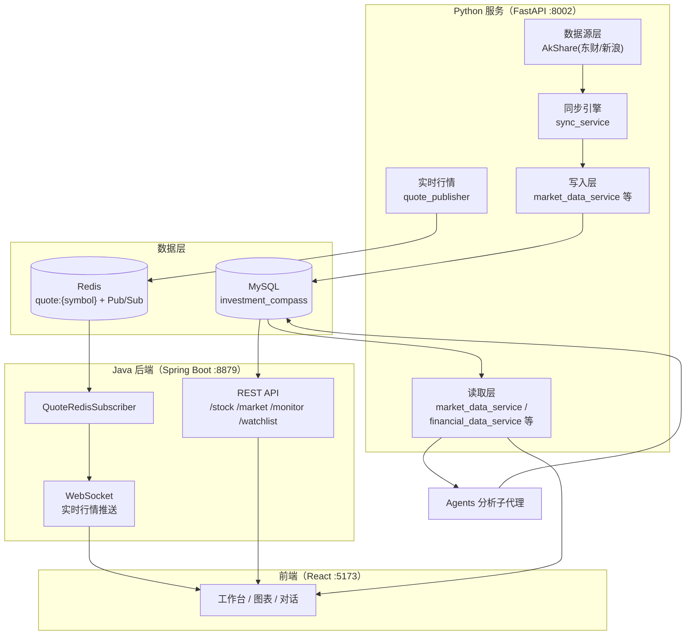

# 数据中台总体架构

> 文档系列：数据中台（`docs/data-platform/`）
> 本文档：01-总体架构
> 配套文档：[02-数据写入链路](./02-数据写入链路.md) / [03-数据读取规范](./03-数据读取规范.md)

## 1. 文档目的与范围

本文档描述 Investment Compass 数据中台的整体架构，包括：

- 数据中台在系统中的定位与分层
- 核心数据域与数据表（读写矩阵）
- 三条数据流：历史数据写入、数据读取、实时行情推送
- 关键设计原则与工程约定

**范围约定**：数据以 Python 服务侧（`python-service/`）为唯一写入方，Java 后端（`java-backend/`）与 Python 侧共同读取。

## 2. 系统拓扑



**角色划分**：

| 组件 | 角色 | 说明 |
|---|---|---|
| Python 服务（:8002） | 数据生产方（唯一写入方） | 数据源采集、清洗、幂等写入；也承担数据读取 |
| Java 后端（:8879） | 数据消费方（只读） | 提供 REST API、WebSocket，内部只读 MySQL |
| MySQL | 数据主存储 | K 线、元数据、同步任务、质量问题、自选股、对话 |
| Redis | 实时行情通道 | 盘口快照 Hash + Pub/Sub 广播 |

## 3. 分层架构

```
┌─────────────────────────────────────────────────────────────┐
│  接入层    FastAPI 路由 /api/fetch/*、/api/stock/* 等        │
├─────────────────────────────────────────────────────────────┤
│  服务层    sync_service / market_data_service /              │
│            stock_metadata_service / quote_publisher ...      │
├─────────────────────────────────────────────────────────────┤
│  公共层    shared/（data_filter、akshare_throttle、           │
│            datetime_ts、models ...）                         │
├─────────────────────────────────────────────────────────────┤
│  数据源层  data_source/（akshare_source、factory）            │
├─────────────────────────────────────────────────────────────┤
│  存储层    MySQL（主）/ Redis（实时）                        │
└─────────────────────────────────────────────────────────────┘
```

- **接入层**：对外暴露 REST 接口（数据写入触发、查询、对话）
- **服务层**：业务逻辑，读写两侧的模块边界
- **公共层**：跨服务复用的工具与规则（数据过滤、节流、时间换算）
- **数据源层**：统一封装 AkShare（东财为主、新浪回退）
- **存储层**：MySQL 主存储，Redis 仅承载实时行情，不落盘业务数据

## 4. 核心数据域与读写矩阵

| 表 | 数据域 | 写入方 | 读取方 | 写入入口 |
|---|---|---|---|---|
| `market_data` | K 线行情（多周期） | Python | Python / Java | `upsert_market_data`（幂等 upsert） |
| `stock_metadata` | 股票/指数元数据 | Python | Python / Java | `ensure_stock_metadata` / `init_metadata` |
| `sync_task` | 批量回填任务状态 | Python | Java | `sync_task_service`（断点续传） |
| `data_quality_issue` | 数据质量问题 | Python | Java | 数据过滤/校验落库 |
| `watchlist` | 自选股 | Python | Java | `watchlist_service` |
| `conversation` | 对话会话 | Python | Python | `chat_service` |
| `message` | 对话消息 | Python | Python | `chat_service` |

> 原则：**单写多读**。业务表只有 Python 侧写入，Java 侧全部只读；Java 仅对 `data_quality_issue.status` 等运维态字段做状态流转。

### 4.1 核心表字段概要

**market_data**（K 线，唯一键 `symbol + timeframe + trade_date`，索引设计见 [04-索引评估与优化方案](./04-索引评估与优化方案.md)）

| 字段 | 类型 | 说明 |
|---|---|---|
| symbol | varchar | 股票代码（含交易所后缀，如 `000001.SZ`） |
| trade_date | date | 交易日（A 股市场日期） |
| timeframe | varchar | 周期：1m/5m/15m/30m/1h/4h/1d |
| ts_open | bigint | K 线开盘 Unix 毫秒时间戳（UTC） |
| open/high/low/close | double | OHLC 价格 |
| volume | bigint | 成交量（股） |
| amount | double | 成交额（元） |
| pct_chg | double | 涨跌幅（%） |
| closed | int | 1=已收盘，0=正在形成 |
| fetched_at | datetime | 最近抓取时间（upsert 自动刷新） |

**stock_metadata**（元数据）

| 字段 | 说明 |
|---|---|
| symbol / stock_name | 代码（6 位）/ 名称 |
| type | `STOCK` / `INDEX` |
| source | 数据来源（akshare） |
| is_active | 是否启用（供 Java 覆盖率统计） |

**sync_task**（回填任务，状态机见下文 5.2）

| 字段 | 说明 |
|---|---|
| symbol / start_year / end_year | 任务唯一维度 |
| current_year | 断点续传游标 |
| status | PENDING / RUNNING / SUCCESS / FAILED / PARTIAL |
| records_fetched / retry_count / error_msg | 进度与错误信息 |

## 5. 数据流

### 5.1 历史数据写入流（Python 独占）

```
AkShare 数据源（东财 stock_zh_a_hist / 新浪 stock_zh_a_daily 回退）
  → 节流器（跨线程全局 0.9s 最小间隔）
  → 重试（3 次，指数退避 2s/4s/6s）
  → 数据清洗（normalize_ohlcv_df → KlineBar）
  → 质量过滤（data_filter：OHLC>0、low≤close≤high、volume≥0、|pct_chg|<100）
  → 幂等 upsert（INSERT ... ON DUPLICATE KEY UPDATE）
  → 元数据兜底（ensure_stock_metadata）
```

两条写入模式：

| 模式 | 入口 | 特征 |
|---|---|---|
| 增量同步 | `POST /api/fetch/market` / `sync_symbols` | 按最新日期增量，`estimate_days_since` 估算补 N 根，上限 14 根 |
| 批量回填 | `POST /api/fetch/batch` / `batch_fetch` | 按年拉取，断点续传 + 并发 2（可调至 5），单年失败降级 PARTIAL |

**幂等保证**：以 `symbol + trade_date + timeframe` 为唯一键，重复写入不产生脏数据。

### 5.2 批量回填任务状态机

```
PENDING ──启动──▶ RUNNING ──全部年份完成──▶ SUCCESS
                    │  ├─ 单年失败（已成功年份保留）──▶ PARTIAL
                    │  └─ 致命异常 ──▶ FAILED
                    ▼
        （断点续传：重启后从 current_year + 1 继续）
```

PARTIAL / FAILED 任务再次触发时自动从 `current_year + 1` 续传。

### 5.3 数据读取流（Java / Python 双侧）

```
MySQL
  ├─▶ Python: get_kline_history / get_realtime_quote / financial 等
  │          （供 Agents 分析、对话、图表）
  └─▶ Java:  StockService / MonitorService / MarketBoardService
             （/stock/kline、/stock/quote、/monitor/*、/market/*）
```

Java 读取端点一览：

| 分组 | 端点 | 数据来源 |
|---|---|---|
| 股票 | `/stock/search` `/stock/quote` `/stock/kline` `/stock/detail/{symbol}` `/stock/indicators/{symbol}` | stock_metadata / market_data |
| 大盘 | `/market/indices` `/market/ranking` | market_data |
| 监控 | `/monitor/overview` `/monitor/backfill-progress` `/monitor/coverage` `/monitor/quality-issues` | market_data / stock_metadata / sync_task / data_quality_issue |
| 自选股 | `/watchlist/*` | watchlist |
| 实时 | WebSocket | Redis → QuoteRedisSubscriber |

### 5.4 实时行情流（Redis 通道）

```
AkShare stock_zh_a_spot（盘内 3s 轮询，盘外 60s）
  → 写 Redis Hash quote:{symbol}
  → Pub/Sub 频道 "quotes"（整批 JSON 广播）
  → Java QuoteRedisSubscriber 订阅
  → WebSocket 推送到前端
```

实时行情只走 Redis，**不落 MySQL**；落库仍由增量同步负责。

## 6. 模块清单

### 6.1 Python 写入侧

| 模块 | 职责 |
|---|---|
| [sync_service.py](../../python-service/services/sync_service.py) | 同步编排：增量 / 批量 / 断点续传 / 并发 |
| [market_data_service.py](../../python-service/services/market_data_service.py) | K 线 upsert、最新日期、历史查询、实时行情读取 |
| [stock_metadata_service.py](../../python-service/services/stock_metadata_service.py) | 元数据注册、搜索、全量初始化 |
| [sync_task_service.py](../../python-service/services/sync_task_service.py) | 回填任务状态管理 |
| [quote_publisher.py](../../python-service/services/quote_publisher.py) | 实时行情轮询与 Redis 发布 |
| [data_source/akshare_source.py](../../python-service/data_source/akshare_source.py) | AkShare 数据源封装 |
| [shared/data_filter.py](../../python-service/shared/data_filter.py) | 入库前质量过滤规则 |
| [shared/akshare_throttle.py](../../python-service/shared/akshare_throttle.py) | 数据源节流 |

### 6.2 Python 读取侧

| 模块 | 职责 |
|---|---|
| `market_data_service.get_kline_history` | K 线历史查询（日期范围 / limit） |
| `financial_data_service` / `industry_service` / `valuation_service` | 财务、行业、估值数据 |
| `chat_service` | 对话会话与消息 |
| `agents/*` | 分析子代理读取行情/财务数据 |

### 6.3 Java 读取侧

| 模块 | 职责 |
|---|---|
| [StockService](../../java-backend/src/main/java/com/xiaosuo/investmentcompass/service/StockService.java) + StockController | K 线、行情、详情、指标 |
| [MonitorService](../../java-backend/src/main/java/com/xiaosuo/investmentcompass/service/MonitorService.java) + MonitorController | 数据质量与同步监控 |
| [MarketBoardService](../../java-backend/src/main/java/com/xiaosuo/investmentcompass/service/MarketBoardService.java) | 大盘看板 |
| [QuoteRedisSubscriber](../../java-backend/src/main/java/com/xiaosuo/investmentcompass/redis/QuoteRedisSubscriber.java) + WebSocket | 实时行情链路 |

## 7. 关键设计原则

1. **单写多读**：业务数据只有 Python 写，规避双写冲突；Java 只读。
2. **写入幂等**：K 线统一 `ON DUPLICATE KEY UPDATE`，可安全重试。
3. **入库前过滤**：`data_filter` 在写入前拦截非法数据，防止脏数据污染。
4. **限流保护**：全局节流 + 有限并发 + 指数退避重试，规避第三方 API 限流。
5. **断点续传**：批量回填以 `sync_task` 记录游标，崩溃/失败可续跑。
6. **存储分工**：MySQL 管历史与状态，Redis 只管实时，职责分离。
7. **可观测性**：同步状态、覆盖率、质量 issue 均落库，Java 侧可监控。

## 8. 关联文档

- [02-数据写入链路](./02-数据写入链路.md)：Python 写入侧实现细节（同步策略、节流、重试、过滤、幂等）
- [03-数据读取规范](./03-数据读取规范.md)：Java / Python 两侧查询约定与字段语义对齐
- [API 文档](../../api-document.md)：对外接口契约
