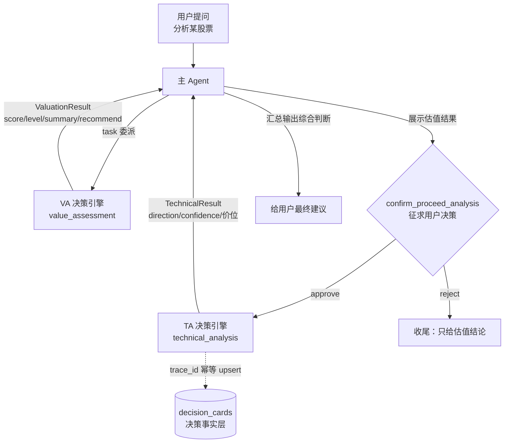
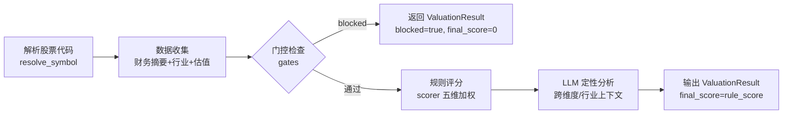

# VA 与 TA 决策引擎流程讲解

> 本文档讲解 Investment Compass 的两大决策引擎：**VA（value_assessment，价值评估）**与 **TA（technical_analysis，技术分析）**的完整决策流程。基于 `python-service` 实际代码整理。
>
> 相关代码：
> - VA：[agents/value_assessment_agent.py](../agents/value_assessment_agent.py)、[agents/value_valuation/scorer.py](../agents/value_valuation/scorer.py)、[agents/value_valuation/gates.py](../agents/value_valuation/gates.py)
> - TA：[agents/technical_analysis_agent.py](../agents/technical_analysis_agent.py)、[agents/pa_agent.py](../agents/pa_agent.py)

---

## 0. 一句话总览

**VA 回答"值不值得买"**：先用规则引擎做门控拦截 + 五维加权评分，再用 LLM 做定性分析，输出 0-100 估值分与等级；
**TA 回答"现在能不能买"**：先用算法算清市场状态（趋势/量能/波动/结构），再用 LLM 做两阶段决策（市场诊断 → 交易决策），输出买卖方向与关键价位。
**主 Agent 把两者串联**：VA 结论作为 TA 的背景信息输入，最终建议由 TA 的技术方向决定。

---

## 1. 总体架构：主 Agent 的两阶段编排



关键编排（定义于 [AGENTS.md](../AGENTS.md)「投资分析编排」）：

1. 委派 **VA** 做估值评估
2. 展示估值结果后，**必须**调用 `confirm_proceed_analysis` 中断征求用户决策（HITL）
3. `approve` 后委派 **TA**，输入 JSON `{"stock_identifier": "...", "va_summary": {...}}`——`va_summary` 直接复用 VA 返回字段
4. 最终建议由 TA 的技术方向决定（buy→买入 / sell→卖出 / neutral→观望），VA 结论作背景，两者矛盾时提示风险

---

## 2. VA 决策引擎（value_assessment）

### 2.1 定位

基于财务数据（ROE/PE/PB/负债率等）给股票**估值打分**，返回评分与等级。架构为 **规则引擎（可复现、确定）+ LLM 定性分析（细腻、可解释）** 双层：

- 规则引擎：`assess_value` 工具（门控 + 评分），纯代码，确定性
- LLM：子 Agent 阅读工具返回的数据做定性分析，输出结构化 `ValuationResult`

### 2.2 决策流程



**Step 1 代码解析**：`resolve_symbol` 统一通过 DB 补全交易所后缀；6 位数字直接使用。解析失败返回 `error`。

**Step 2 数据收集**（全部带异常隔离，单源失败不阻塞）：
- `get_financial_abstract`：财务摘要（ROE/毛利率/净利率/增速/负债率等）
- `get_industry`：行业分类（取 L2 粗分类使行业调整生效）
- `get_valuation`：估值数据（PE-TTM/PB/收盘价/市值）
- **回测模式**：模块级注入 `as_of` 历史时点，只取"当时已披露"数据，避免未来信息

**Step 3 门控检查**（[gates.py](../agents/value_valuation/gates.py)）——**硬拦截，命中即终止**：

| 门控 | 条件 | 结论 |
|---|---|---|
| G1 | 财务数据缺失 | block：无法评估 |
| G2 | ST / *ST / ROE 缺失 | block：风险警示股或数据不足 |
| G3 | ROE < 0 | block：盈利能力不足 |
| G4 | 资产负债率 > 90% | block：财务风险过高 |

非阻塞**警告**（不影响评分，随结果返回）：数据不完整、营收利润双降（趋势向下）、负债率 > 70%。

**Step 4 规则评分**（[scorer.py](../agents/value_valuation/scorer.py)）——**五维加权，确定性输出**：

| 维度 | 基础权重 | 评分子项 |
|---|---|---|
| 盈利能力 | **30%** | ROE(0.4) + 毛利率(0.3) + 净利率(0.3) |
| 成长性 | **25%** | 营收增速(0.5) + 利润增速(0.5) |
| 估值 | **20%** | PE + PB 均值 |
| 财务健康 | **15%** | 资产负债率(0.6) + 流动比率(0.4) |
| 收益质量 | **10%** | 经营现金流/净利润 |

- **行业调整**（L2 粗分类模糊匹配）：消费/医药 盈利+5%、成长-5%；科技 盈利-5%、成长+10%；金融 盈利+5%、成长-10%、健康+5%；周期 成长-5%、估值+10%
- **估值缺失兜底**：PE/PB 均缺失时估值权重**转移给盈利能力**
- 权重重归一化后加权求总，**等级映射**：≥80 优质 / ≥60 良好 / ≥40 一般 / <40 差
- 规则分 < 40 时标记 `score_below_llm_threshold=true`

**Step 5 LLM 定性分析**（子 Agent，核心价值）：
- 数据质量判断（字段缺失在 summary 中说明）
- 跨维度矛盾发现（营收增但利润率降、盈利好但现金流差）
- 行业上下文（周期股低谷 ROE 低属正常）
- 输出规则：**final_score 直接取 rule_score 不调整**；summary 2-3 句；recommend 由评分与定性共同决定（≥60 或基本面健康 → true，blocked 或 <40 → false）

### 2.3 输出 Schema（ValuationResult）

```
stock_code / stock_name / blocked / block_reason
final_score(0-100) / final_level(good/fair/average/poor)
summary / recommend / reason
warnings[] / industry / pe_ratio / pb_ratio
```

---

## 3. TA 决策引擎（technical_analysis）

### 3.1 定位

`CompiledSubAgent`，内部是一个 7 节点 LangGraph（**Stage1 市场诊断 → Stage2 交易决策**两阶段编排）。纯算法指标层为 LLM 提供**客观锚点**，杜绝 LLM 凭空捏造 K 线事实。


### 3.2 逐节点流程

**① parse_node — 解析与算法计算**
- 输入：主 Agent 传入的 JSON（`stock_identifier` + `va_summary`，回测可加 `as_of`）或自然语言
- 获取 100 根日线 K 线（回测按 `as_of` 截断）
- `_compute_market_data(bars)` 纯算法计算（详见 3.3）
- **唯一一处生成 `trace_id`**（决策幂等键，贯穿落库/报告/飞书）

**② features_node — 程序结构特征**
- 用 `pa_features`（`from_bars` → `render_all_features`）把 K 线渲染成**结构化特征文本**，作为 LLM 的客观锚点；失败返回空串不阻塞

**③ stage1_node — 市场诊断（LLM，1 次调用）**
- 输入：结构特征文本 + K 线摘要
- 输出 `MarketDiagnosis`：`cycle_position`（通道位置）/ `direction`（bullish/bearish/neutral）/ `market_phase` / `diagnosis_confidence` / `detected_patterns` / `key_signals` / `support_levels` / `resistance_levels` / `risk_warning`
- 解析失败兜底返回空诊断，不阻塞 Stage2

**④ load_strategies_node — 策略路由（纯代码）**
- 基线路由 `_route_strategy(market_data)`：
  - `structure.channel_type`（bull_channel / bear_channel / trading_range）→ 对应通道策略文件
  - `atr_pct < 1.0` → 追加窄宽通道策略
  - `|hl_trend_pct| > 8` → 追加极速上涨/下跌分析与交易策略
  - 追加基础文件（逐棒检查单/K线信号/止损止盈/MeasuredMove）+ A 股专属（按信号关键词匹配）
- **Stage1 覆盖**：若 `direction` 明确（bullish/bearish）且 `cycle_position` 非 unknown，用 `_override_channel_files` 按方向替换通道族文件（bullish→上涨通道、bearish→下跌通道），其余保持
- 拼接全部策略文本注入 `strategy_text`

**⑤ inject_experience_node — 经验注入（读侧经验闭环）**
- 从 Chroma 经验库检索相似历史案例（含失败反例）注入 `experience_refs`
- 检索 query 融合用户原始意图 + `cycle_hint`/`channel_type` 结构提示
- **回测模式禁用**（历史时点之后的经验属于未来信息）；失败仅告警置空

**⑥ pa_node — 交易决策（LLM，1 次调用）**
- 输入：Stage1 诊断 + 结构特征 + 策略库 + 历史经验 + VA 估值摘要（`va_summary`）
- 输出 `TechnicalResult`（完整字段见 3.5），含 Stage2 扩展决策字段（order_type / entry_price / 止损止盈 / 预估胜率 / 关键因素 / 观察点）
- 解析失败兜底返回 neutral 方向

**⑦ merge_node — 汇总与副作用**
- 构建 `TechnicalResult` 并 `model_dump()` 作为 `structured_response` 返回主 Agent（携带 `trace_id`）
- **非回测模式**才执行：`_save_decision_card`（落库）+ `_notify_feishu`（推送）

### 3.3 核心算法深度拆解

TA 的确定性算法分 **4 层**，全部无 LLM（约 0.1s 内完成），为两阶段 LLM 提供客观锚点：

1. **指标计算层**（[pa_agent.py](../agents/pa_agent.py)）：EMA / SMA / ATR / 波段高低点
2. **市场状态层**（`_compute_market_data`）：趋势 / 量能 / 波动 / 结构分类
3. **策略路由层**（`_route_strategy` + Stage1 覆盖）：按状态选策略文件
4. **逐棒几何特征层**（[pa_features/kline_features.py](../pa_features/kline_features.py)）：单棒/多棒形态分类

#### 3.3.1 指标计算层

**EMA（指数移动平均）** — `_ema(data, period)`：
`multiplier = 2/(period+1)`，从首根价格起迭代平滑：
`EMA[i] = (data[i] − EMA[i−1]) × multiplier + EMA[i−1]`
（预热期无跳过：直接用首根作为种子，后续全序列有值）

**SMA（简单移动平均）** — `_sma(data, period)`：
滑动窗口**增量更新**，O(n) 而非 O(n·period)：
`cum += data[i] − data[i−period]`，`SMA[i] = cum/period`

**ATR（平均真实波幅，Wilder 平滑）** — `_atr(high, low, close, period=14)`：
`TR[i] = max(H−L, |H−C₋₁|, |L−C₋₁|)`
首个 ATR = 前 14 个 TR 的算术均值；之后 Wilder 递推：
`ATR[i] = (ATR[i−1] × (period−1) + TR[i]) / period`

**波段高低点（Swing）** — `_detect_swing_highs_lows(bars, window=5)`：
局部极值检测：某根 K 的前后各 `window` 根内若**没有更高的 high** 即标记为 swing high，**没有更低的 low** 即 swing low。用于推导最近支撑/阻力候选。

#### 3.3.2 市场状态层（`_compute_market_data`）

基于 100 根日线（`bars[0]` 为最新，计算前反转为 oldest-first，算完再反转对齐）：

**① 价格相对位置**：
`range_20 = high_20 − low_20`，`pos_in_range = (close − low_20) / range_20`
→ 0-100% 的 20 日区间位置，判断价格处于区间上沿还是下沿。

**② 趋势判断**：
- 短期趋势：`MA5 vs MA20` → up / down / sideways
- EMA20 斜率：`(EMA20[0] − EMA20[min(4,n−1)]) / EMA20[...] × 100`（近 4 根的百分比变化）
- 价格偏离：`(close − EMA20) / EMA20 × 100`

**③ 量比与量能**：
- 量比：每根 K 的成交量 ÷ 其后 5 日均量（滑动窗口），取最新
- 量能趋势：`近5日均量 vs 前10日均量`，>1.2× 放量（expanding）、<0.8× 缩量（contracting）、否则平稳

**④ 波动率**：`ATR% = ATR14 / close × 100`，另有单日振幅%

**⑤ 结构分类（通道判定）**——基于最近 20 根高低点的**趋势斜率**：

| 条件（newest-first 高低点变化率） | 分类 | cycle_hint |
|---|---|---|
| `hl_trend > 3` 且 `ll_trend > 2` | bull_channel | 上涨通道 |
| `hl_trend < −2` 且 `ll_trend < −3` | bear_channel | 下跌通道 |
| 其余 | trading_range | 震荡区间 |

**⑥ 信号生成**：价格偏离 EMA20 ±2%、量比 >2（放量）/ <0.5（缩量）、MA5 与 MA20 上下穿，各生成一条中文信号文本。

#### 3.3.3 策略路由层

**基线路由 `_route_strategy(market_data)`**（纯代码，按市场状态拼接策略文件）：

| 触发条件 | 追加策略 |
|---|---|
| `structure.channel_type` | 对应通道/区间文件（上涨通道 / 下跌通道 / 震荡区间，各含分析与交易两个文件） |
| `atr_pct < 1.0` | 窄宽通道策略 |
| `\|hl_trend_pct\| > 8` | 极速上涨/下跌（分析 + 交易） |
| 恒有 | 基础文件：逐棒分析检查单 / K线信号识别 / 止损止盈与仓位管理 / MeasuredMove |
| 信号含关键词（涨停/缺口/支撑阻力/板块联动） | A 股专属文件 |

**Stage1 方向覆盖** `_override_channel_files`：当 Stage1 诊断 `direction` 明确（bullish/bearish）且 `cycle_position` 非 unknown 时，**替换通道族文件**（bullish→上涨通道、bearish→下跌通道），其余文件保持。即：算法结构分类给出基线，LLM 市场诊断有权纠正通道方向。

#### 3.3.4 逐棒几何特征层（pa_features）

将每根 K 线渲染为**确定性的几何事实**（不推断结论），作为 Stage1/Stage2 的逐棒客观锚点，最新 12 根渲染成中文 Markdown 表格。

**单棒特征**（`_feature_for_bar`）：
- 实体比 `body_ratio = |C−O| / (H−L)`、上/下影线占比、收盘位置 `(C−L)/(H−L)`（0-1 归一化）、`幅/ATR`
- 对 EMA20 关系：上 / 下 / 贴
- 棒型分类（`_classify_bar`）：内包 → `inside`；外包（阳/阴）→ `outside_bull/bear`；实体比 ≤0.25 → `doji`（十字星）；阳线且收位 ≥0.65 → `trend_bull`；阴线且收位 ≤0.35 → `trend_bear`；其余 `other`

**多棒模式**（两棒/三棒组合，均在"新→旧"顺序上判断）：
- **重叠比**：与前棒高低区间的交集占比
- **内包序列**：2 连内包（ii）/ 3 连内包（iii）
- **IOI 模式**：`内包(prev2→prev3) → 外包(prev→prev2) → 内包(bar→prev)` 的收缩-扩张-收缩形态
- **微双（MDB/MDT）**：当前棒低点/高点与前棒相差 ≤ `ATR×2%` 容差 → 潜在双底/双顶
- **EMA 缺口**：低点高于 EMA（上缺）/ 高点低于 EMA（下缺）；连续同侧缺口棒数
- **突破前区间**：突破前 5 根的最高/最低（破高/破低/双破）
- **跟随验证**：信号棒之后 2 根是否同向延续（跟/无/败/待）

#### 3.3.5 容错与规范化（`_coerce_*`）

LLM 输出 JSON 常见偏差的防御：缺 `stock_code/stock_name` → 从 state 补全；`support/resistance` 输出为列表（常见误用）→ **回退算法层 `nearest_support/nearest_resistance`**；`signals` 输出为 dict → 扁平化；`diagnosis_confidence` 浮点 → 整数。任何节点异常均兜底（空诊断 / neutral 方向），不阻断链路。

### 3.4 与 VA 的关系

TA 是**独立**决策引擎：VA 的 `va_summary` 仅作为背景信息注入（Stage2 上下文）与决策落库使用，**不参与**算法指标与市场诊断计算。

### 3.5 输出 Schema（TechnicalResult）

```
stock_code / stock_name
direction(buy/sell/neutral) / confidence(0-1) / trace_id
market_cycle / patterns[] / support / resistance / signals[] / summary / risk_warnings[]
# Stage2 扩展决策字段
order_type(限价单/突破单/市价单/不下单) / entry_price / take_profit_price
stop_loss_price / invalidation_price / estimated_win_rate / key_factors[] / watch_points[]
```

---

## 4. 决策事实落库（decision_cards）

两个引擎的决策结果最终由 TA 的 `merge_node` 落库（[technical_analysis_agent.py](../agents/technical_analysis_agent.py) `_save_decision_card`）：

- **trace_id 幂等**：同一次决策（同一 trace_id）重复执行 `INSERT ... ON DUPLICATE KEY UPDATE` 收敛到同一行，不产生重复卡片
- 字段：symbol / action(BUY/SELL/HOLD) / confidence / 支撑阻力 / reasoning（估值+技术双摘要拼接）/ data_sources（估值+技术原始结果）/ market_cycle / sector / pattern / status=PENDING
- **报告归档**：主 Agent 侧按 `{trace_id}.md/.json` 命名写入 `data/reports/{symbol}/`，重放收敛到同一文件
- **回测旁路**：`backtest_mode` 下不落库、不推送、不注入经验，避免污染线上决策事实层

---

## 5. 数据流与边界总结

| 维度 | VA | TA |
|---|---|---|
| 回答的问题 | 值不值得买（基本面） | 现在能不能买（技术面） |
| 架构 | 规则引擎 + LLM 定性 | 算法指标 + 两阶段 LLM |
| LLM 调用次数 | 1 | 2（诊断 + 决策） |
| 确定性部分 | 门控 + 五维加权评分 | 算法指标 + 策略路由 |
| 输出 | ValuationResult | TechnicalResult |
| 对对方的影响 | va_summary 作为 TA 背景 | 无（独立决策） |
| 兜底策略 | blocked 直接终止 | 各节点异常降级不阻塞 |

> **设计要点**：两层都遵循「**确定性规则/算法在前，LLM 定性在后**」——规则层保证可复现与客观锚点，LLM 层负责细腻判断；且每一层都有异常兜底（blocked / 空诊断 / neutral），保证任何单点失败都不阻断整条分析链路。
